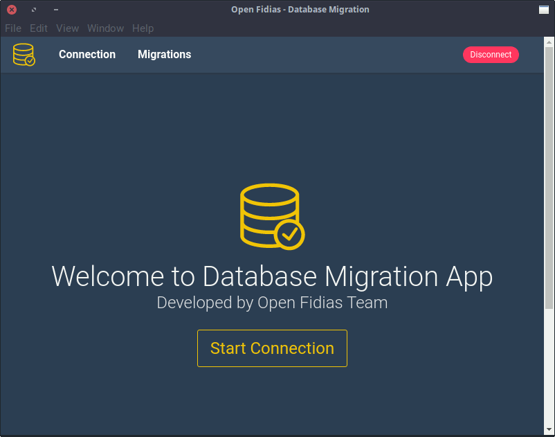

# Fidias Database Migration App


Desktop database migration app based on SQL files.

It's built with [Electron](https://electron.atom.io/)
and uses [marv](https://github.com/guidesmiths/marv) as the migration tool.

## See it in action!



## Getting Started

To install the app go to [Releases Page](https://github.com/open-fidias/db-migration-app/releases)
and download the app for your system.

The `AppImage` version runs on Linux without installation. Just double click it.

The `deb` version is for Debian/Ubuntu based systems. You can install through
`GDebi` or `dpkg`.

```bash
sudo dpkg -i db-migration-app_x.x.x_amd64.deb
```

Replace `x` for the version.

The `exe` version is portable for Windows. Just run as a normal user.

## Development

```bash
git clone https://github.com/open-fidias/db-migration-app.git
cd db-migration-app
yarn # or npm install
npm run dev
```

## Create a release

```bash
npm run build
```

## Create a release with Docker

```bash
# run container
docker run --rm -ti -v ${PWD}:/project -v ${PWD##*/}-node-modules:/project/node_modules -v ~/.electron:/root/.electron electronuserland/electron-builder:wine
# install dependencies
yarn
# create release for GNU/Linux
npm run build
# create release for Windows
npm run build:win32
```

## Acknowledgment

This project was generated from [electron-vue](https://github.com/SimulatedGREG/electron-vue) using [vue-cli](https://github.com/vuejs/vue-cli). Documentation about this project can be found [here](https://simulatedgreg.gitbooks.io/electron-vue/content/index.html).

* [Electron](https://electron.atom.io/) - Build cross platform desktop apps
with JavaScript, HTML, and CSS.
* [marv](https://github.com/guidesmiths/marv) - Marv is a programmatic database migration tool with plugable drivers for MySQL and PostgreSQL.
* [Bulma](http://bulma.io/) - A modern CSS framework based on Flexbox.
* [VueJS](https://vuejs.org) - A progressive framework for building user interfaces.
