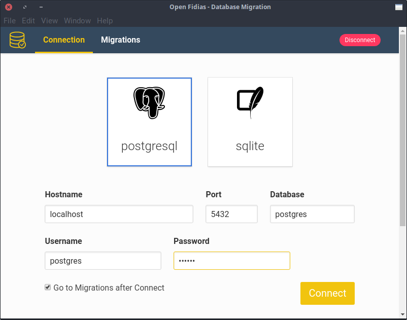
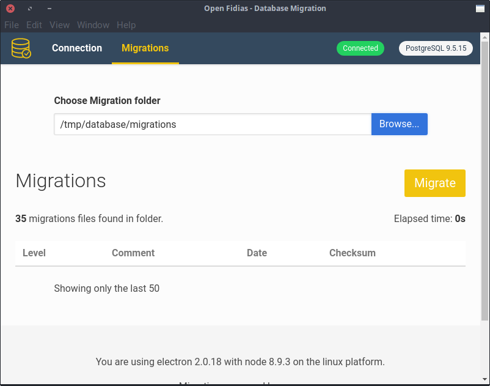

# Introduction

DB Migration App is a Desktop database migration app based on SQL files.

It's built with [Electron](https://electron.atom.io/)
and uses [marv](https://github.com/guidesmiths/marv) as the migration tool.


## Installation

To install the app go to [Releases Page](https://github.com/open-fidias/db-migration-app/releases)
and download the app for your system.

The `AppImage` version runs on Linux without installation. Just double click it.

The `deb` version is for Debian/Ubuntu based systems. You can install through
`GDebi` or `dpkg`.

```bash
sudo dpkg -i db-migration-app_x.x.x_amd64.deb
```

Replace `x` with the actual version.

The `exe` version is portable for Windows. Just run as a normal user.

The Mac version requires MacOS and currently we're not able to build it.

## How does it work?

You can start configuring the database connection. Example connection to PostgreSQL:



After click the button `Connect`, you can select your migration directory. The directory
must contain only `.sql` files, such as:

```
└── migrations/
    ├── 001.create-table.sql
    └── 002.create-another-table.sql
```

Filenames must be in the form `<level><separator><comment>.sql` where:

- `level` must be numeric
- `separator` can be any non numeric
- `comment` can contain any characters except `.` (dot)



## Acknowledgment

This project was generated from [electron-vue](https://github.com/SimulatedGREG/electron-vue) using [vue-cli](https://github.com/vuejs/vue-cli). Documentation about this project can be found [here](https://simulatedgreg.gitbooks.io/electron-vue/content/index.html).

* [marv](https://github.com/guidesmiths/marv) - Marv is a programmatic database migration tool with plugable drivers for MySQL, SQLite and PostgreSQL.
* [Electron](https://electron.atom.io/) - Build cross platform desktop apps with JavaScript, HTML, and CSS.
* [VueJS](https://vuejs.org) - A progressive framework for building user interfaces.
* [Bulma](http://bulma.io/) - A modern CSS framework based on Flexbox.
